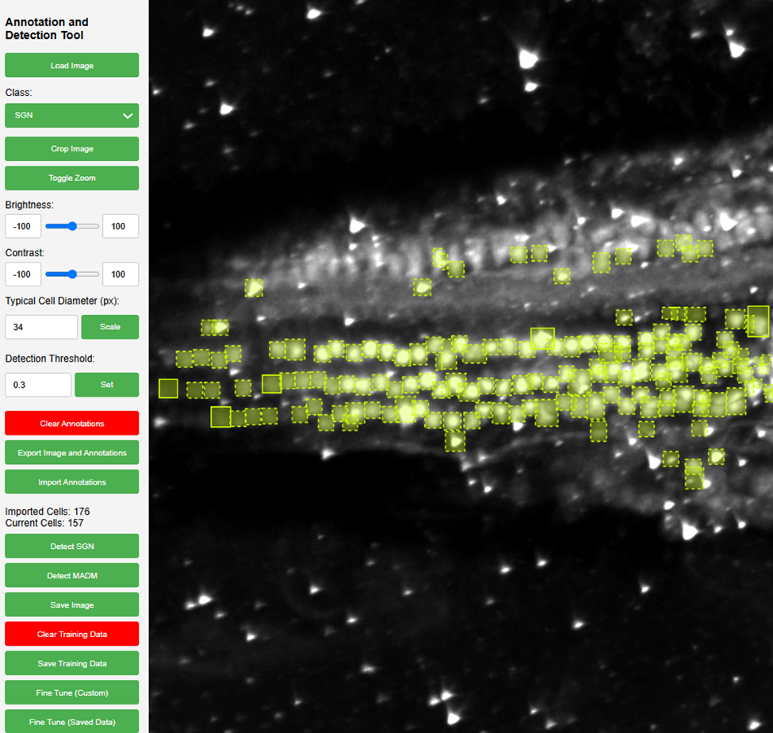

# Automatic Cell Annotation Tool

[YouTube Demonstration](https://youtu.be/IhLrQrVeXEQ)

The primary objective is to enable biologists with little to no programming experience to deploy and use ML models for object detection purposes. A cell detection tool (mainly SGN and MADM) which allows a user to use object detection models to detect cells in a microscope image.

The tool uses keras-retinanet for detection.



## Features

- Automatically detects SGN and MADM cells
- Real time detection of cell count
- You can add new annotations or remove the detected annotations after detection is completed
- You can fine tune the model, either by uploading your own images and  corresponding annotations, or by using the images you have previously used on this tool.
- Crop, zoom, brightness and contrast changes to adjust view of image. Can also change the threshold limit of brightness and contrast.

## Installation (Linux Tested)


1) Download the original keras-retinanet from [fizyr/keras-retinanet](https://github.com/fizyr/keras-retinanet). Place it in the app directory  
Replace `./keras_retinanet/utils/image.py`, `./keras_retinanet/utils/colors.py`, and `./keras_retinanet/utils/gpu.py` with the py files provided in the repo.


Check [here](https://docs.anaconda.com/anaconda/install/index.html) for Anaconda documentation.  
Open Anaconda Prompt and create a virtual environment. I have already provided a conda environment environment.yml file which you can use to help get started.

```bash
conda env create -f environment.yml
```

then run

```bash
conda activate environment.yml
```

to be extra sure about having the required packages, run the following in the environment:

```bash
pip install -r requirements.txt
```


Go to the code directory, e.g. `.../keras-retinanet-main/`, in Anaconda Prompt.  
Install keras-retinanet `pip install . --user`.  
To run the code directly from the directory, run `python setup.py build_ext --inplace` to compile Cython code.


## Deployment

Before deploying the project, ensure you have the following directories. If not create them. The app should create them on their own, but for your own reference, these folders are essential for it to function. (They are empty at the start before starting it)


Make sure to have the following folders setup within the repo:
- uploads
- images
- input
- output
- output/output_csv
- ft_upload
- normalize
- saved_annotations
- saved_data
- converted (has to be manually cleared. PNG images buildup over time)
- finaloutput
- snapshots (**IMPORTANT**)

Download the following weights and copy them into the /snapshots directory:
[SGN_Rene.h5](https://drive.google.com/file/d/10JCk6W6pC7nVWfHJ7Ew6xvyWLEeKxbV2/view?usp=sharing)
[combine.h5](https://drive.google.com/file/d/1ADUyTbD1wxKvsMnuvF0YZr5K9Wn5iwk3/view?usp=sharing)

these are essential for the detection and retraining scripts scripts to run successfully. The tool makes use of these folders to store and transfer images, after which they are regularly cleared to prevent buildup/mixing of data.


```bash
  python app.py
```

Then open your browser, and open the following link:

```bash
127.0.0.1:5000/static/index.html
```
It is hosted on a static IP address, so anyone connected to the same network will be able to access the application. Just replace the localhost (127.0.0.1) IP address with the IP address of your hostname, keep everything else the same.
Essentially, your directory should roughly look like this:


## Acknowledgements

 - [COMBINe: Cell detectiOn in Mouse BraIN](https://github.com/yccc12/COMBINe/tree/main)
 - [keras-retinanet](https://github.com/fizyr/keras-retinanet)

